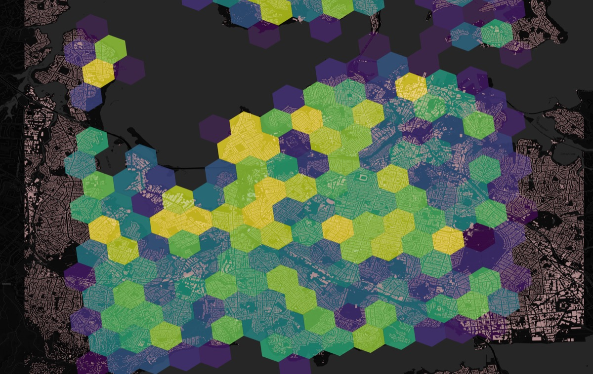

<!--  -->

Spatial analysis covers many methods for understanding how things are arranged in space. While they may look related, the methods answer different questions and therefore require different data preparation, parameter tuning, and interpretation. This post explains the main families of methods, gives practical guidance, and lists alternatives and complementary approaches.

## Why distinguish methods?

Different spatial questions call for different tools. Conflating them leads to wrong inferences: a clustering algorithm that finds groups is not a test of randomness; a global autocorrelation statistic is not a map of local hotspots. Make the question explicit first (e.g., "are there discrete groups?" vs "is density heterogeneous?") and choose tools that map to that question.

## A short taxonomy

- Clustering (detect discrete groups)
- Dispersion / randomness testing (do points deviate from random?)
- Density / heterogeneity (how does intensity vary across space?)

Each family has many algorithms; they are complementary rather than interchangeable.

## 1) Clustering — find groups

Purpose: identify discrete clusters of points or contiguous regions of similar behaviour.

Common algorithms
- DBSCAN / HDBSCAN — density-based clustering. DBSCAN uses two parameters (eps, min_samples). HDBSCAN is hierarchical and often more robust (fewer parameters to tune) for variable density.
- OPTICS — produces an ordering and reachability plot that helps extract clusters at different scales (good when cluster density varies).
- K-Means — centroid-based (assumes spherical clusters and requires number of clusters).
- Spatially constrained clustering (e.g., SKATER) — enforces spatial contiguity for areal units.

When to use
- Use density-based methods (DBSCAN/HDBSCAN/OPTICS) when clusters are irregularly shaped and you don't want to pre-specify cluster counts.
- Use K-Means for compact, convex clusters where the number of clusters is known or can be estimated.

Alternatives and complements
- For hierarchical structure: agglomerative clustering on distance matrices.
- For clusters with attribute similarity: combine spatial and attribute distances or use GMMs with spatial priors.
- Validate with silhouette scores, stability across parameters, or domain-ground truth.

Practical tips
- Use projected (metric) CRS for Euclidean distance-based clustering; lat/lon directly will distort distances except for very small areas.
- For DBSCAN, tune eps with a k-distance plot; for HDBSCAN, experiment with min_cluster_size.
- Visualize reachability plots (OPTICS) to find stable cluster cuts.

## 2) Dispersion / randomness — measure global spatial arrangement

Purpose: test whether a point pattern is clustered, random, or regular.

Common measures
- Nearest Neighbour Index (NNI) — compares observed nearest-neighbour distances to the expected value under complete spatial randomness (CSR).
- Ripley’s K or L function — multiscale summary of clustering/dispersion across radii.
- Global Moran’s I — measures spatial autocorrelation for areal data or binned counts.

When to use
- Use NNI or Ripley’s K for purely point-pattern questions (events in continuous space).
- Use Moran’s I for areal units or aggregated counts (e.g., counts per hexagon or administrative area).

Alternatives and complements
- Quadrat tests for coarse-scale randomness tests.
- Monte Carlo envelopes for Ripley’s K to assess significance across scales.

Practical tips
- Edge effects matter: use border corrections or toroidal corrections where appropriate.
- Monte Carlo permutation tests help assess statistical significance.

## 3) Density & heterogeneity — measure spatial variation of intensity

Purpose: describe how intensity (counts per area) changes across space and identify hotspots or heterogeneity.

Common approaches
- Kernel Density Estimation (KDE) — continuous surface estimate of intensity. Bandwidth selection is crucial.
- Hexagonal binning (H3, regular hex grids) — aggregate counts into cells and compute heterogeneity metrics (variance, Gini, entropy).
- Local indicators of spatial association (LISA) and Getis-Ord Gi* — identify local hotspots and coldspots.
- Spatial regression (GWR) — model spatially varying relationships when covariates exist.

When to use
- Use KDE to produce smooth intensity surfaces when point locations are dense and you care about continuous variation.
- Use H3 or hex-binning to produce discrete aggregates for comparison, heterogeneity metrics, or map overlays.
- Use LISA/Gi* to test local clustering of high/low values.

Alternatives and complements
- Use adaptive bandwidth KDE for variable densities.
- Use Bayesian spatial models (e.g., BYM) when you need formal uncertainty quantification for areal counts.

Practical tips
- Choose H3 resolution (or hex size) to match the scale of interest — test multiple resolutions.
- When computing heterogeneity metrics (variance, Gini, entropy), remember results depend on binning/resolution.

## Choosing between methods: a short decision guide

- You want discrete groups → clustering (DBSCAN/HDBSCAN/OPTICS, K-Means if shapes are spherical).
- You want to test randomness/scale of clustering → Ripley’s K, NNI, or Monte Carlo tests.
- You want to map intensity and hotspots → KDE, hex/H3 aggregation + Gi*/LISA, or spatial regression.

Often, a combined workflow is best: cluster to find groups, then aggregate clusters to hexes and compute heterogeneity; or produce KDE surfaces and test hotspots using Gi*.

## Examples and alternatives (practical choices)

- DBSCAN vs HDBSCAN: DBSCAN is simple and fast but sensitive to eps. HDBSCAN builds a hierarchy and extracts stable clusters — try HDBSCAN when densities vary.
- OPTICS: use when you suspect nested clusters or variable densities; inspect the reachability plot.
- KDE vs H3 aggregation: KDE gives continuous surfaces; H3 gives discrete cells that are easy to compare, index, or compute metrics on.
- Moran’s I vs Gi*: Moran’s I tests global autocorrelation; Gi* finds local hotspots.
- Spatial regression (GWR, MGWR) vs kernel methods: regression models explain variation with covariates; KDE and H3 describe intensity without explaining it.

## Reproducible tools and libraries (quick pointers)

- Python: scikit-learn (DBSCAN, OPTICS), hdbscan (HDBSCAN), geopandas / shapely (geometry handling), h3 (hex indexing), scipy/statsmodels, esda (spatial autocorrelation), pointpats (point pattern analysis), libpysal (spatial weights), mgwr (geographically weighted regression).
- R: spatstat (rich point-pattern tools), sf (spatial data), spdep (autocorrelation), dbscan/hdbscan packages.

This repository includes notebooks demonstrating several workflows (see `optics_h3_heterogeneity_detections.ipynb` and `optics_h3_heterogeneity.ipynb`). Those are practical examples combining OPTICS clustering, H3 aggregation, and heterogeneity metrics.

## Common pitfalls and edge cases

- CRS mistakes: performing Euclidean clustering in lat/lon will give wrong distances—always reproject for metric analyses.
- Scale dependency: clustering and heterogeneity depend on your spatial scale (bandwidth, eps, H3 resolution). Try several scales and report sensitivity.
- Sparse data: KDE and local tests may be unstable with very few points—consider aggregation or model-based approaches.
- Multiple testing: local tests across many cells require correction or careful interpretation.

## Suggested workflow (practical recipe)

1. Inspect the data and choose an appropriate CRS.
2. Visualize raw point patterns and compute simple summaries (counts, NNI).
3. Try a density-based clustering (HDBSCAN/OPTICS) to find candidate groups.
4. Aggregate points to hex/cells (H3) at 2–3 resolutions and compute heterogeneity metrics (variance, Gini, entropy).
5. Run hotspot analysis (Local Gi*, LISA) on aggregated counts.
6. Validate: Monte Carlo simulations, parameter sensitivity, and domain validation.

## Conclusion and next steps

There is no single "best" spatial method — pick the tool that answers your question. Use complementary methods to cross-validate and be transparent about parameter choices and scale. The notebooks in this repo provide runnable examples; try them on your data and compare H3 resolutions, clustering parameters, and heterogeneity metrics.

## Further reading and resources

- The notebooks in this repo, especially `optics_h3_heterogeneity_detections.ipynb`.
- H3 documentation for hexagonal indexing (useful for aggregations and spatial joins).
- `spatstat` (R) for deep point-pattern analysis and Ripley’s K.
- `esda` and `libpysal` for spatial autocorrelation and weights in Python.

