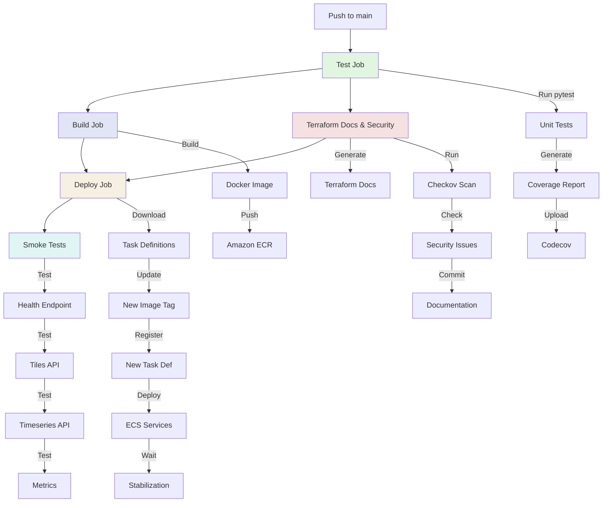
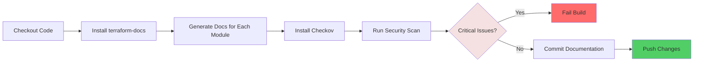
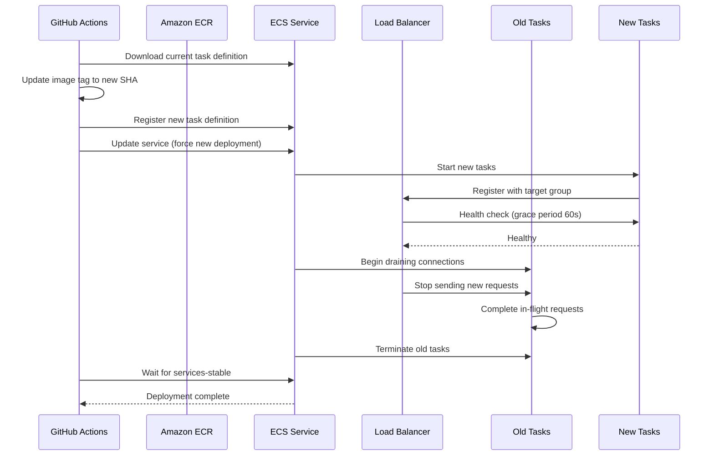

For the automation of the deployment pipeline for a scientific data platform, I wanted something that would handle everything from running tests to deploying to production—without manual intervention. GitHub Actions turned out to be the perfect tool for this, offering a balance of power, flexibility, and ease of use that made enterprise-grade CI/CD accessible.

This post walks through building a complete CI/CD pipeline that handles testing, Docker image building, security scanning, infrastructure documentation, AWS ECS deployment, and smoke testing. This guide provides practical patterns you can adapt to your own projects.

## Why GitHub Actions for Enterprise CI/CD?

Before diving into the implementation, it's worth understanding why GitHub Actions works well for enterprise deployments:

**Native Integration**: Lives in your repository, no external service to configure
**Flexible Workflows**: YAML-based configuration with powerful job orchestration
**Secrets Management**: Built-in secure storage for credentials and tokens
**Matrix Builds**: Test across multiple environments simultaneously
**Marketplace**: Thousands of pre-built actions for common tasks
**Cost-Effective**: Generous free tier, pay-per-minute for private repos

The key insight: GitHub Actions isn't just for simple CI tasks. With proper architecture, it handles complex deployment workflows that rival dedicated CI/CD platforms.

## Pipeline Overview

Our pipeline consists of five sequential jobs that run on every push to the main branch:


As diagram

![GitHub Actions CI CD pipeline flowchart showing five primary jobs and their substeps. Primary subjects are Test Job, Build Job, Terraform Docs and Security Job, Deploy Job, and Smoke Tests Job. Arrows show sequence: Push to main leads to Test Job, which leads to Build Job and Terraform Docs and Security job in parallel, both feeding into Deploy Job, followed by Smoke Tests. Substeps transcribed include Run pytest, Unit Tests, Generate Coverage Report, Upload Codecov, Build Docker Image, Push to Amazon ECR, Generate Docs for Each Module, Run Checkov Scan, Check for Critical Issues, Commit Documentation, Push Changes, Download Task Definitions, Update New Image Tag, Register New Task Definition, Deploy to ECS Services, Wait for Stabilization, Test Health Endpoint, Tiles API, Timeseries API, Metrics. The diagram uses color coded boxes for each major job and arrows for dependencies; overall tone is technical and instructional.]({{ "/assets/diagrams/svg/_posts_2025-11-28-Enterprise-CICD-GitHub-Actions.md_0.svg" | absolute_url }})
Each job has a specific responsibility and only runs if its dependencies succeed. This ensures we never deploy broken code or skip critical security checks.

## Job 1: Testing — The Foundation

Every good pipeline starts with tests. Our test job runs on every push and pull request, providing fast feedback on code quality.

```yaml
test:
  name: Run Tests
  runs-on: ubuntu-latest
  
  steps:
    - name: Checkout code
      uses: actions/checkout@v4
    
    - name: Set up Python 3.12
      uses: actions/setup-python@v5
      with:
        python-version: "3.12"
        cache: 'pip'
    
    - name: Install dependencies
      run: |
        python -m pip install --upgrade pip
        pip install -r app/requirements.txt
    
    - name: Run pytest with coverage
      run: |
        cd app
        PYTHONPATH=. pytest tests/ --cov=app --cov-report=xml --cov-report=term
    
    - name: Upload coverage report
      uses: codecov/codecov-action@v4
      with:
        file: ./app/coverage.xml
        flags: unittests
        token: ${{ secrets.CODECOV_TOKEN }}
      if: github.event_name == 'push' && github.ref == 'refs/heads/main'
```

### Key Patterns

**Dependency Caching**: The `cache: 'pip'` option caches Python packages between runs, reducing installation time from 2-3 minutes to 10-20 seconds.

**Coverage Reporting**: We generate both XML (for Codecov) and terminal output (for immediate feedback in logs). The `continue-on-error: true` ensures deployment isn't blocked if Codecov is down.

**Conditional Uploads**: Coverage only uploads on main branch pushes, avoiding noise from pull requests.

### What This Catches

- Syntax errors and import issues
- Failing unit tests
- Regression in test coverage
- Breaking changes before they reach production

## Job 2: Building Docker Images

Once tests pass, we build a Docker image and push it to Amazon ECR. This job only runs on the main branch—pull requests get tested but not built.

```yaml
build:
  name: Build and Push Docker Image
  runs-on: ubuntu-latest
  needs: test
  if: github.event_name == 'push' && github.ref == 'refs/heads/main'
  
  outputs:
    image-tag: ${{ steps.meta.outputs.tags }}
  
  steps:
    - name: Checkout code
      uses: actions/checkout@v4
    
    - name: Configure AWS credentials
      uses: aws-actions/configure-aws-credentials@v4
      with:
        aws-access-key-id: ${{ secrets.AWS_ACCESS_KEY_ID }}
        aws-secret-access-key: ${{ secrets.AWS_SECRET_ACCESS_KEY }}
        aws-region: ap-southeast-2
    
    - name: Login to Amazon ECR
      id: login-ecr
      uses: aws-actions/amazon-ecr-login@v2
    
    - name: Extract metadata for Docker
      id: meta
      run: |
        ECR_REPO="${{ secrets.ECR_REPOSITORY }}"
        echo "tags=${{ steps.login-ecr.outputs.registry }}/${ECR_REPO}:${{ github.sha }}" >> $GITHUB_OUTPUT
        echo "latest=${{ steps.login-ecr.outputs.registry }}/${ECR_REPO}:latest" >> $GITHUB_OUTPUT
    
    - name: Build Docker image
      run: |
        cd app
        docker build -t ${{ steps.meta.outputs.tags }} -t ${{ steps.meta.outputs.latest }} .
    
    - name: Push Docker image to ECR
      run: |
        docker push ${{ steps.meta.outputs.tags }}
        docker push ${{ steps.meta.outputs.latest }}
```

### Image Tagging Strategy

We tag each image twice:

1. **Git SHA tag** (`abc123def`): Immutable reference to specific commit
2. **Latest tag** (`latest`): Always points to most recent build

This dual-tagging enables both reproducible deployments (using SHA) and simple local development (using latest).

### Security Considerations

**Short-Lived Credentials**: AWS credentials are configured per-job, not stored in environment variables.

**ECR Authentication**: The `amazon-ecr-login` action handles token generation and expiration automatically.

**Secrets Validation**: We check that `ECR_REPOSITORY` is set before attempting to build, providing clear error messages.

## Job 3: Documentation and Security Scanning

This job runs in parallel with the build job, generating Terraform documentation and scanning for security issues. It's one of the most valuable parts of the pipeline.



### Terraform Documentation Generation

```yaml
- name: Install terraform-docs
  run: |
    wget https://github.com/terraform-docs/terraform-docs/releases/download/v0.17.0/terraform-docs-v0.17.0-linux-amd64.tar.gz
    tar -xzf terraform-docs-v0.17.0-linux-amd64.tar.gz
    chmod +x terraform-docs
    sudo mv terraform-docs /usr/local/bin/

- name: Generate documentation for root module
  run: |
    cd terraform
    terraform-docs markdown table --output-file README.md --output-mode inject .

- name: Generate documentation for network module
  run: |
    cd terraform/modules/network
    terraform-docs markdown table --output-file README.md --output-mode inject .
```

This automatically generates tables of inputs, outputs, and resources for each Terraform module. The `inject` mode updates existing README files without overwriting custom content.

**Before automation**: Manually updating documentation after every variable change
**After automation**: Documentation always matches code, zero maintenance

### Security Scanning with Checkov

```yaml
- name: Run checkov security scan
  run: |
    checkov --directory terraform \
      --framework terraform \
      --config-file terraform/.checkov.yml \
      --output cli \
      --output json \
      --output-file-path . \
      --soft-fail
  continue-on-error: true

- name: Check for critical security issues
  run: |
    if [ ! -f "results_json.json" ]; then
      echo "⚠️ Checkov report not found, skipping security check"
      exit 0
    fi
    
    CRITICAL_COUNT=$(jq -r '[.results.failed_checks[] | select(.severity == "CRITICAL")] | length' results_json.json)
    HIGH_COUNT=$(jq -r '[.results.failed_checks[] | select(.severity == "HIGH")] | length' results_json.json)
    
    echo "📊 Security Scan Summary:"
    echo "  - Critical severity issues: $CRITICAL_COUNT"
    echo "  - High severity issues: $HIGH_COUNT"
    
    if [ "$CRITICAL_COUNT" -gt 0 ]; then
      echo "❌ CRITICAL severity security issues found!"
      jq -r '.results.failed_checks[] | select(.severity == "CRITICAL") | "  - [\(.check_id)] \(.check_name)"' results_json.json
      exit 1
    fi
    
    echo "✅ No critical security issues found - deployment can proceed"
```

### Smart Security Gating

The key insight here: **not all security issues should block deployment**.

We use a tiered approach:
- **CRITICAL**: Block deployment (unencrypted data, public access)
- **HIGH**: Warn but allow (missing tags, overly permissive rules)
- **MEDIUM/LOW**: Log only (best practices, optimization suggestions)

This prevents security fatigue while ensuring genuine risks are addressed.

### Automatic Documentation Commits

```yaml
- name: Commit and push documentation changes
  run: |
    git config --local user.email "41898282+github-actions[bot]@users.noreply.github.com"
    git config --local user.name "github-actions[bot]"
    git add terraform/**/README.md || true
    
    if git diff --staged --quiet; then
      echo "✅ No documentation changes to commit"
    else
      git commit -m "docs: update Terraform module documentation [skip ci]"
      git push
    fi
  if: github.event_name == 'push' && github.ref == 'refs/heads/main'
```

The `[skip ci]` tag prevents infinite loops—documentation commits don't trigger new pipeline runs.

## Job 4: Deployment to AWS ECS

This is where the magic happens: taking a new Docker image and deploying it to production with zero downtime.



### The Deployment Process

```yaml
- name: Download tiles service task definition
  run: |
    aws ecs describe-task-definition \
      --task-definition ${{ secrets.ECS_TASK_DEFINITION_TILES }} \
      --query taskDefinition > tiles-task-definition.json

- name: Update tiles task definition with new image
  run: |
    NEW_IMAGE="${{ steps.login-ecr.outputs.registry }}/${{ secrets.ECR_REPOSITORY }}:${{ github.sha }}"
    cat tiles-task-definition.json | \
      jq --arg IMAGE "$NEW_IMAGE" '.containerDefinitions[0].image = $IMAGE | del(.taskDefinitionArn, .revision, .status, .requiresAttributes, .compatibilities, .registeredAt, .registeredBy)' > tiles-task-definition-new.json

- name: Register new tiles task definition
  run: |
    aws ecs register-task-definition \
      --cli-input-json file://tiles-task-definition-new.json

- name: Update tiles ECS service
  run: |
    aws ecs update-service \
      --cluster ${{ secrets.ECS_CLUSTER }} \
      --service ${{ secrets.ECS_SERVICE_TILES }} \
      --task-definition ${{ secrets.ECS_TASK_DEFINITION_TILES }} \
      --force-new-deployment

- name: Wait for tiles service deployment to stabilize
  run: |
    aws ecs wait services-stable \
      --cluster ${{ secrets.ECS_CLUSTER }} \
      --services ${{ secrets.ECS_SERVICE_TILES }}
```

### Zero-Downtime Deployment

ECS handles the rolling deployment automatically:

1. **Start new tasks** with updated image
2. **Wait for health checks** (60-second grace period)
3. **Register with load balancer** once healthy
4. **Drain old tasks** (stop sending new requests)
5. **Terminate old tasks** after connections close

The `deployment_minimum_healthy_percent = 50` setting ensures at least half the tasks remain available during deployment.

### Handling Multiple Services

We deploy two services (tiles and timeseries) sequentially. An alternative approach would be parallel deployment:

```yaml
strategy:
  matrix:
    service: [tiles, timeseries]
steps:
  - name: Deploy ${{ matrix.service }} service
    run: |
      # Deployment logic here
```

We chose sequential deployment to:
- Reduce AWS API rate limiting
- Catch issues in one service before deploying the other
- Simplify troubleshooting

## Job 5: Smoke Testing

The final job validates that the deployment actually works. These aren't comprehensive integration tests—they're quick sanity checks that catch obvious problems.

```yaml
smoke-tests:
  name: Run Smoke Tests
  runs-on: ubuntu-latest
  needs: deploy
  
  steps:
    - name: Wait for service stabilization
      run: sleep 60
    
    - name: Test health endpoint
      run: |
        RESPONSE=$(curl -s -o /dev/null -w "%{http_code}" ${{ secrets.ALB_URL }}/health)
        if [ "$RESPONSE" != "200" ]; then
          echo "❌ Health check failed with status code: $RESPONSE"
          exit 1
        fi
        echo "✅ Health check passed"
    
    - name: Test tiles endpoint
      run: |
        RESPONSE=$(curl -s -o /tmp/tile.png -w "%{http_code}" "${{ secrets.ALB_URL }}/tiles/test-collection/10/512/512.png")
        if [ "$RESPONSE" != "200" ]; then
          echo "❌ Tiles endpoint failed with status code: $RESPONSE"
          exit 1
        fi
        FILE_TYPE=$(file -b --mime-type /tmp/tile.png)
        if [ "$FILE_TYPE" != "image/png" ]; then
          echo "❌ Tiles endpoint did not return a PNG image"
          exit 1
        fi
        echo "✅ Tiles endpoint passed"
    
    - name: Test timeseries endpoint
      run: |
        RESPONSE=$(curl -s -w "\n%{http_code}" "${{ secrets.ALB_URL }}/api/timeseries?lon=150&lat=-33&start=2024-01-01T00:00:00Z&end=2024-01-31T23:59:59Z&variable=temp")
        HTTP_CODE=$(echo "$RESPONSE" | tail -n1)
        BODY=$(echo "$RESPONSE" | head -n-1)
        
        if [ "$HTTP_CODE" != "200" ]; then
          echo "❌ Timeseries endpoint failed"
          exit 1
        fi
        
        if ! echo "$BODY" | jq empty 2>/dev/null; then
          echo "❌ Timeseries endpoint did not return valid JSON"
          exit 1
        fi
        echo "✅ Timeseries endpoint passed"
```

### What Smoke Tests Catch

- **Service not starting**: Health check fails
- **Wrong image deployed**: Application errors
- **Configuration issues**: Missing environment variables
- **Network problems**: Load balancer misconfiguration
- **API regressions**: Endpoints returning errors

### What They Don't Catch

Smoke tests are intentionally shallow. They don't:
- Test business logic thoroughly
- Validate data correctness
- Check performance under load
- Test error handling edge cases

For comprehensive testing, you'd add integration tests that run against a staging environment before production deployment.

## Cost Estimation with Infracost

We run a separate workflow for infrastructure cost estimation on pull requests:

```yaml
infracost:
  name: Infracost Cost Estimate
  runs-on: ubuntu-latest
  
  steps:
    - name: Setup Infracost
      uses: infracost/actions/setup@v3
      with:
        api-key: ${{ secrets.INFRACOST_API_KEY }}
    
    - name: Generate Infracost diff
      run: |
        infracost diff --path=terraform \
                       --format=json \
                       --compare-to=/tmp/infracost-base.json \
                       --out-file=/tmp/infracost.json
    
    - name: Post Infracost comment
      run: |
        infracost comment github --path=/tmp/infracost.json \
                                 --repo=$GITHUB_REPOSITORY \
                                 --github-token=${{ github.token }} \
                                 --pull-request=${{ github.event.pull_request.number }}
```

This posts a comment on pull requests showing the cost impact of infrastructure changes:

```
💰 Infracost Estimate

Monthly cost will increase by $45 (+18%)

  + aws_ecs_service.new_service    $30
  + aws_elasticache_cluster.redis  $15

Total: $295/month → $340/month
```

This visibility helps teams make informed decisions about infrastructure changes before merging.

## Secrets Management

The pipeline requires several secrets configured in GitHub:

```bash
# AWS Credentials
AWS_ACCESS_KEY_ID          # IAM user with ECS/ECR permissions
AWS_SECRET_ACCESS_KEY      # Corresponding secret key

# ECS Configuration
ECR_REPOSITORY             # ECR repository name
ECS_CLUSTER                # ECS cluster name
ECS_SERVICE_TILES          # Tiles service name
ECS_SERVICE_TIMESERIES     # Timeseries service name
ECS_TASK_DEFINITION_TILES  # Tiles task definition family
ECS_TASK_DEFINITION_TIMESERIES  # Timeseries task definition family

# Testing
ALB_URL                    # Load balancer URL for smoke tests

# Optional
CODECOV_TOKEN              # For coverage reporting
INFRACOST_API_KEY          # For cost estimation
```

### Security Best Practices

**Use IAM roles when possible**: For GitHub Enterprise, use OIDC to assume IAM roles instead of long-lived credentials.

**Scope permissions narrowly**: The deployment IAM user should only have permissions for ECS, ECR, and CloudWatch—not full admin access.

**Rotate credentials regularly**: Set a reminder to rotate AWS keys every 90 days.

**Use environment-specific secrets**: Separate secrets for staging and production deployments.

## Workflow Triggers and Conditions

Understanding when jobs run is crucial for efficient pipelines:

```yaml
on:
  push:
    branches:
      - main
  pull_request:
    branches:
      - main
```

This configuration means:
- **Pull requests**: Run tests and security scans only
- **Main branch pushes**: Run full pipeline including deployment

### Conditional Job Execution

```yaml
if: github.event_name == 'push' && github.ref == 'refs/heads/main'
```

This condition ensures deployment jobs only run on main branch pushes, not on pull requests or other branches.

### Path-Based Triggers

For the Infracost workflow, we only run when Terraform files change:

```yaml
on:
  pull_request:
    paths:
      - 'terraform/**'
      - '.github/workflows/infracost.yml'
```

This saves CI minutes and reduces noise on pull requests that don't affect infrastructure.

## Monitoring and Observability

### Workflow Status Badges

Add a status badge to your README:

```markdown

```

This provides at-a-glance visibility into pipeline health.

### Notification Strategies

GitHub Actions can notify external services on workflow completion:

```yaml
- name: Notify Slack on failure
  if: failure()
  uses: slackapi/slack-github-action@v1
  with:
    webhook-url: ${{ secrets.SLACK_WEBHOOK }}
    payload: |
      {
        "text": "Deployment failed for ${{ github.sha }}"
      }
```

### Logging Best Practices

Our pipeline uses emoji and formatting for scannable logs:

```bash
echo "✅ Health check passed"
echo "❌ Deployment failed"
echo "📊 Security Scan Summary:"
echo "⚠️  Warning: High severity issues found"
```

This makes it easy to scan logs and identify issues quickly.

## Performance Optimization

### Caching Dependencies

```yaml
- name: Set up Python
  uses: actions/setup-python@v5
  with:
    python-version: "3.12"
    cache: 'pip'
```

This caches pip packages between runs, reducing installation time by 80-90%.

### Parallel Job Execution

Jobs with `needs: test` run in parallel after tests complete:

```yaml
build:
  needs: test
  # Runs in parallel with terraform-docs-security

terraform-docs-security:
  needs: test
  # Runs in parallel with build
```

This reduces total pipeline time from ~15 minutes (sequential) to ~8 minutes (parallel).

### Artifact Sharing

For workflows that need to share files between jobs:

```yaml
- name: Upload build artifact
  uses: actions/upload-artifact@v4
  with:
    name: docker-image
    path: /tmp/image.tar

# In a later job:
- name: Download build artifact
  uses: actions/download-artifact@v4
  with:
    name: docker-image
```

We don't use this pattern since ECR serves as our artifact store, but it's useful for other scenarios.

## Troubleshooting Common Issues

### Issue: Permission Denied on Documentation Commit

**Error**: `remote: Permission to user/repo.git denied to github-actions[bot]`

**Solution**: Enable workflow write permissions in repository settings:
- Settings → Actions → General → Workflow permissions
- Select "Read and write permissions"

### Issue: ECS Deployment Timeout

**Error**: `aws ecs wait services-stable` times out after 10 minutes

**Causes**:
- Health checks failing (check CloudWatch logs)
- Security group blocking ALB → ECS traffic
- Task role missing permissions

**Debug**:
```bash
aws ecs describe-services --cluster <cluster> --services <service>
aws ecs describe-tasks --cluster <cluster> --tasks <task-arn>
```

### Issue: Checkov Blocking Valid Configuration

**Error**: Checkov fails on a check that doesn't apply to your use case

**Solution**: Add to `.checkov.yml`:
```yaml
skip-check:
  - CKV_AWS_123  # Reason: Not applicable because...
```

### Issue: Smoke Tests Failing After Successful Deployment

**Cause**: Services need time to fully initialize after ECS reports "stable"

**Solution**: Increase the stabilization wait:
```yaml
- name: Wait for service stabilization
  run: sleep 120  # Increased from 60 seconds
```

## Advanced Patterns

### Matrix Builds for Multi-Environment Deployment

```yaml
deploy:
  strategy:
    matrix:
      environment: [staging, production]
  steps:
    - name: Deploy to ${{ matrix.environment }}
      run: |
        aws ecs update-service \
          --cluster ${{ secrets[format('ECS_CLUSTER_0', matrix.environment)] }} \
          --service ${{ secrets[format('ECS_SERVICE_0', matrix.environment)] }}
```

### Approval Gates for Production

```yaml
deploy-production:
  needs: deploy-staging
  environment:
    name: production
    url: https://api.example.com
  steps:
    # Deployment steps
```

The `environment` key enables manual approval in GitHub's UI before production deployment.

### Rollback on Smoke Test Failure

```yaml
- name: Rollback on failure
  if: failure()
  run: |
    aws ecs update-service \
      --cluster ${{ secrets.ECS_CLUSTER }} \
      --service ${{ secrets.ECS_SERVICE }} \
      --task-definition ${{ env.PREVIOUS_TASK_DEFINITION }}
```

## Lessons Learned

**Start simple, add complexity gradually**: Our first pipeline was just tests and deployment. We added security scanning, documentation, and smoke tests over time as needs emerged.

**Fail fast, fail clearly**: Use descriptive error messages and exit codes. A failed pipeline should immediately tell you what went wrong.

**Don't block on non-critical checks**: Coverage uploads and documentation commits use `continue-on-error: true`. Deployment shouldn't fail because Codecov is down.

**Security scanning needs nuance**: Blocking on all security issues creates alert fatigue. Focus on critical issues that represent genuine risk.

**Smoke tests are worth it**: They've caught deployment issues dozens of times—wrong image tags, configuration errors, network problems.

**Documentation automation pays off**: Auto-generated Terraform docs stay in sync with code, eliminating a common source of drift.

## Conclusion

Building enterprise CI/CD with GitHub Actions requires thoughtful design, but the result is a pipeline that's reliable, maintainable, and provides genuine value. The patterns described here—parallel execution, smart security gating, zero-downtime deployment, and comprehensive smoke testing—create a foundation that scales from small projects to production systems.

The key insights:
- **Test early, deploy confidently**: Comprehensive testing before deployment catches issues when they're cheap to fix
- **Automate everything**: Documentation, security scanning, and deployment should require zero manual steps
- **Fail intelligently**: Not all failures should block deployment—distinguish critical from informational
- **Observe and iterate**: Monitor pipeline performance and failure patterns, continuously improving

Whether you're deploying to ECS, Kubernetes, Lambda, or any other platform, these patterns adapt to your infrastructure. Start with the basics—test, build, deploy—and layer on sophistication as your needs grow.

## Resources

- [GitHub Actions Documentation](https://docs.github.com/en/actions)
- [AWS ECS Deployment Guide](https://docs.aws.amazon.com/AmazonECS/latest/developerguide/deployment-types.html)
- [Checkov Security Scanning](https://www.checkov.io/)
- [Terraform-docs](https://terraform-docs.io/)
- [Infracost](https://www.infracost.io/)
- [Example Repository](https://github.com/bird70/scientific_raster_data_sharing) - Full working implementation
